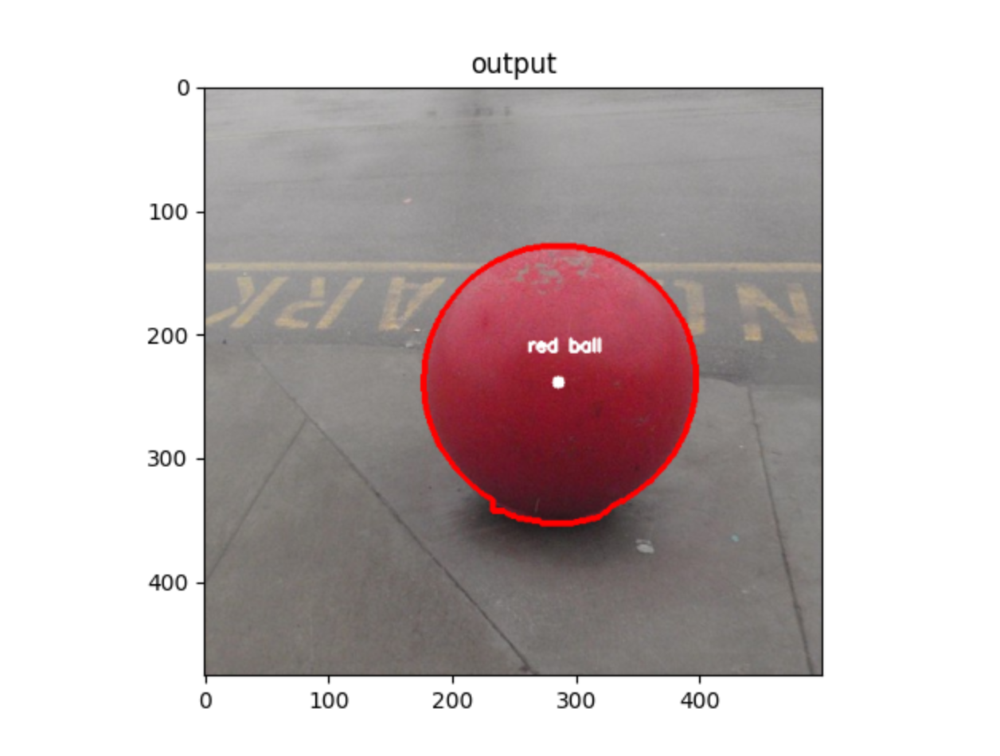

# Red Ball Detection Project

This project uses OpenCV to detect a red ball in images and videos, displaying the detected ball with annotations.

## Table of Contents

- [Introduction](#introduction)
- [Requirements](#requirements)
- [Usage](#usage)
  - [Image Processing](#image-processing)
  - [Video Processing](#video-processing)
- [Results](#results)
- [File Descriptions](#file-descriptions)

## Introduction

This project detects a red ball in images and videos using OpenCV. The process involves:
- Converting the image to HSV color space.
- Creating a mask for the red color.
- Removing noise from the mask.
- Finding contours to detect the ball.
- Annotating the detected ball in the image or video frame.

## Requirements

- Python 3.x
- OpenCV (`cv2`)
- NumPy (`numpy`)
- Matplotlib (`matplotlib`)

You can install the required packages using the following command:
```bash
pip install opencv-python-headless numpy matplotlib
```
## Usage

### Image Processing
The script `image.py` processes an image to detect a red ball and annotates it.

To run the script, use:
```bash
python image.py
```

### Video Processing
The script `video.py` processes a video to detect and annotate a red ball in each frame.

To run the script, use:
```bash
python video.py
```

## Results

### Image Processing Result
After running `image.py`, the output image with the detected red ball annotated will be displayed.



### Video Processing Result
After running `video.py`, the video will play with the red ball being tracked and annotated in each frame.

## File Descriptions

### `image.py`
This script reads an image, processes it to detect a red ball, and annotates the ball with its center and label.

### `video.py`
This script reads a video, processes each frame to detect a red ball, and annotates the ball with its center and label.
